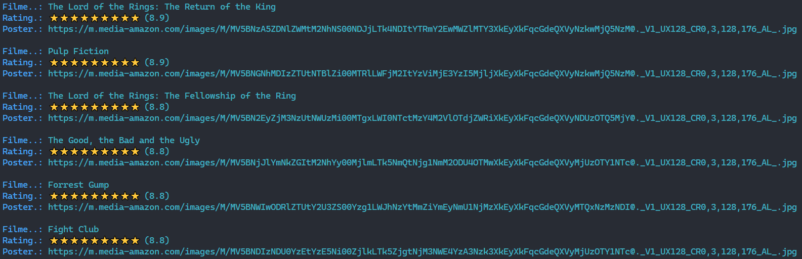

# Imersão Java Alura


## Rodando localmente

Pré requisito:  
Para esse projeto, estou usando dev container no visual studio code.  
[Visual studio dev container](https://code.visualstudio.com/docs/remote/containers)

Clone o projeto

```bash
  git clone https://github.com/krodrigo/alura-imersao-java.git
```

Entre no diretório do projeto

```bash
  cd alura-imersao-java.git
```

Abra o visual studio code na pasta do projeto

```bash
  code .
```

## Dia 01
Consumir, usando java, a API do IMDB dos 250 melhores filmes.  
Criar um aplicação java que vai consumir a API do IMDB e exibir no terminal a resposta.  
A exibição do resultado foi formatada com cores e rating visual.

A url da api foi alterada por um mock, pois o imdb ficou indisponível.

Resultado do primero dia
